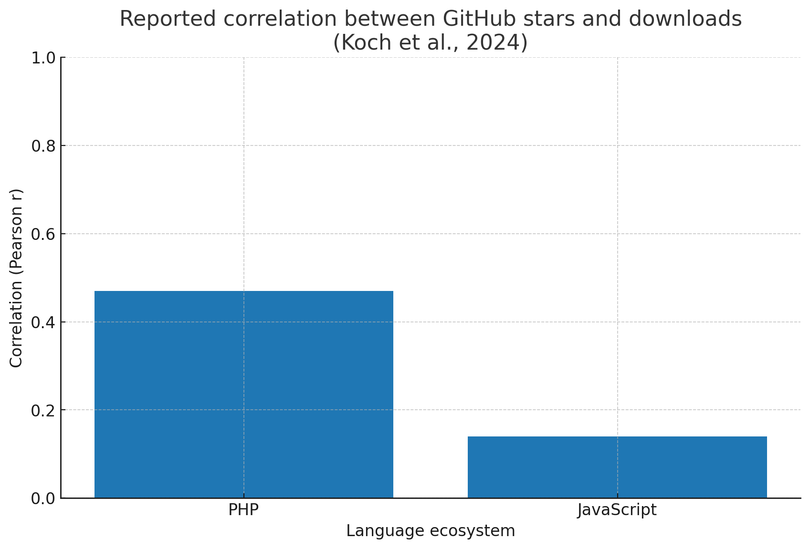
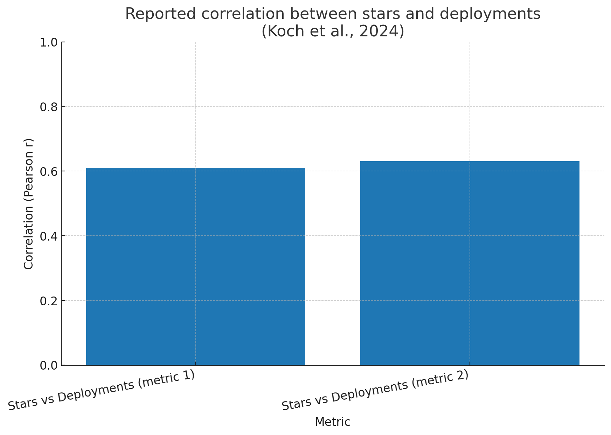

# 📊 Detailed Report: Factors Influencing GitHub Followers & Stars

## 1. Introduction  
GitHub is more than just a code hosting platform—it is a social coding ecosystem where **followers**, **following**, **stars**, and **contributions** shape visibility, influence, and community engagement.  

- **Followers** → Signal credibility and amplify reach.  
- **Following** → Improves discovery and networking opportunities.  
- **Stars** → Act as lightweight endorsements, driving visibility and attention.  
- **Contributions** → Commits, issues, and PRs that build real impact and strengthen reputation.  

Understanding how these elements interact is essential for developers and open-source maintainers seeking sustainable growth.

---

## 2. Correlation Analysis: Stars and Followers  

Stars act as a discovery funnel—repos with more stars often draw more attention, leading to follower growth.  

**Research Findings:**  
- Stars correlate **weakly with downloads** (e.g., *r ≈ 0.14 for JavaScript*, *r ≈ 0.47 for PHP*).  
- Stars correlate **moderately with deployments** (*r ≈ 0.61–0.63*).  
- Stars reflect **visibility and interest** more than actual usage.  

📊 **Charts**:  
  
  

**Insight:** Stars are valuable for *initial discovery*, but they should be validated with contributions, forks, and adoption metrics.  

---

## 3. Impact of Contributions  

Contributions are the strongest driver of long-term follower growth because they directly showcase developer skills and engagement.  

- **Pull Requests (PRs):** Increase visibility in popular repositories.  
- **Issues & Discussions:** Demonstrate collaboration and problem-solving.  
- **Commits:** Show consistency, productivity, and technical depth.  

**Key Observations:**  
- Developers contributing to **high-visibility repos** are more likely to gain new followers.  
- Receiving followers often **reinforces activity**, creating positive feedback loops.  
- Contribution metrics (PR acceptance rate, issue responsiveness) influence perception and credibility.  

---

## 4. Case Studies  

### 🔹 996.ICU  
- Exploded to **200k+ stars in days** after media attention.  
- Account gained thousands of followers.  
- Shows how *social momentum* can rapidly boost both stars and followers.  

### 🔹 Sindre Sorhus (Creator of “awesome” lists)  
- Maintains repos with **hundreds of thousands of stars**.  
- Has **70k+ followers** on GitHub.  
- Illustrates the effect of **sustained contributions** across widely useful repos.  

### 🔹 Appsmith  
- Analyzed their own stargazers to identify where attention came from.  
- Found weak but positive correlation between **stargazer follower counts** and **commit activity**.  
- Shows the value of analytics in guiding growth strategies.  

---

## 5. Best Practices for Increasing Followers  

✅ **Technical Strategies**  
- Contribute to **high-profile projects** in your domain.  
- Maintain repos with clear **README, docs, and examples**.  
- Automate testing (CI/CD) and make it contributor-friendly.  

✅ **Community Engagement**  
- Be **responsive** in issues and PRs.  
- Create “good first issue” labels to attract contributors.  
- Share updates across **Twitter/X, LinkedIn, Dev.to, Reddit**.  

✅ **Growth & Trust**  
- Avoid artificial star boosts (fake stars harm credibility).  
- Track **referrers and star bursts** to identify effective channels.  
- Use analytics (GitHub Insights, custom tools) to monitor growth.  

---

## 6. Conclusion  

- **Stars** are a signal of visibility but correlate only modestly with true adoption.  
- **Contributions**—especially in widely used projects—are the most consistent driver of follower growth.  
- The most sustainable strategy blends **useful repos**, **active contributions**, and **authentic community engagement**.  

**In short:**  
- Stars get you discovered.  
- Contributions make people follow you.  
- Engagement builds long-term influence.  
